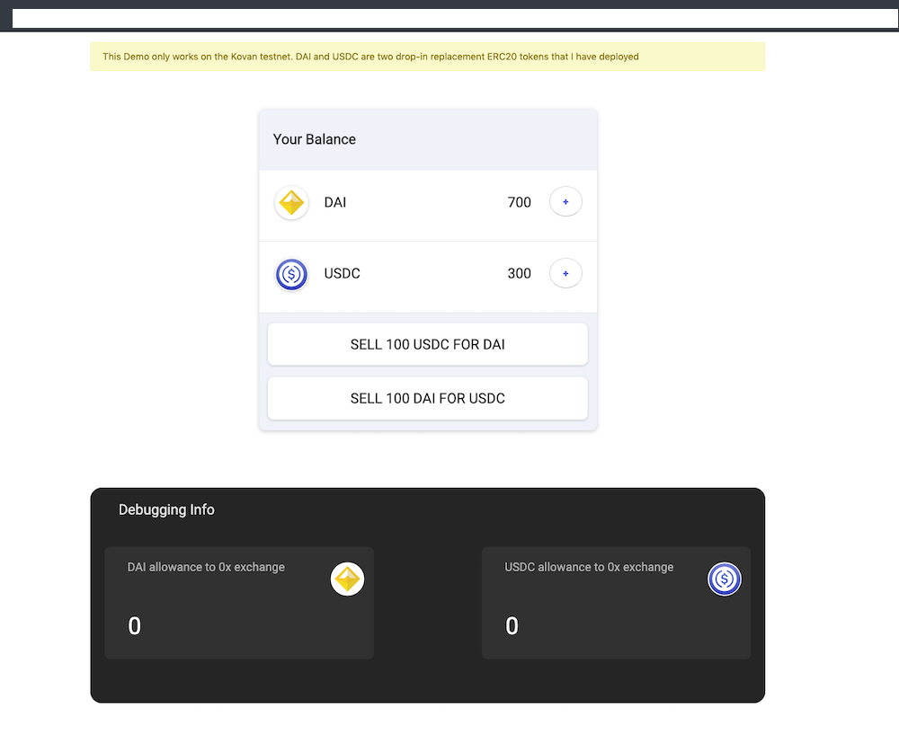

## Create Your Own Exchange

## Goal

You will:

- Hook up a front-end web application to the Ethereum blockchain using 0x libraries.
- Cover important practical tasks around ERC20 tokens
  - How to use `ERC20TokenContract` to interact with a deployed contract 
  - How to convert big integers to base unit numbers using `Web3Wrapper.toBaseUnitAmount()`
  - How to allow the ERC20 Exchange proxy to trade using your wallet funds
- Perform a Swap using the 0x API
  - How to inspect a 0x API swap quote response
  - How to perform with swap in 1 extra line of code!

## Environment setup

This demo will only work on the Kovan testnet.

This tutorial will be using 2 dummy ERC20 token contracts that I deployed on the Kovan testnet. These are not the real DAI and USDC, but they are drop-in replacements. Each contract also exposes a `mint(uint256)` function that can be used to create tokens for the user.

- DAI (18 decimals) is hosted at: `0x48178164eB4769BB919414Adc980b659a634703E`
- USDC (6 decimals) is hosted at: `0x5a719Cf3E02c17c876F6d294aDb5CB7C6eB47e2F`

## Environment setup

This webapp has been tested with Node v10.15.3. Use `npm install` to install all the various dependencies and, after installation finishes successfully, run `npm run serve` to run a live webserver on `http://localhost:9000`. Any change to the TypeScript code will trigger the webpage to refresh with newly compiled code.

### Prerequisites

Please do the following:

* Install [Metamask](https://metamask.io/) (on Chrome) and create a new account (optionally, re-use an existing account)
* Install [VSCode](https://code.visualstudio.com/) (Will make programming in TypeScript much easier)
* **Important!** Mint some KETH by using the [faucet](https://faucet.kovan.network/), or by pasting your address in the [Kovan Gitter](https://gitter.im/kovan-testnet/faucet), please ensure that you have at least 1-2 ETH.
* Install NodeJS, preferably v10.15.3 or higher. If you use Linux as an OS, please ensure that your NodeJS has all the shared libraries, compilers, in order to install packages with native C code.
* Revise [ERC20 token allowances](https://tokenallowance.io/)
* Register for an [Infura account](https://infura.io/) (free)
* Make sure you are comfortable working with JavaScript. You should be familiar with concepts such as promises, `async`/`await` syntax, anonymous functions (or callbacks)
* Optional: [Learn the basics of TypeScript](https://www.typescriptlang.org/docs/handbook/typescript-in-5-minutes.html)

### Task Detail

In this Task, you will build your own DeFi application, which is an exchange that uses [0x API](https://0x.org/api) to easily swap between [DAI](https://makerdao.com/en/) and [USDC](https://www.centre.io/usdc).

 **clone** This repo to get started.

### Check Off

Email us a screenshot of your exchange web app after successfully swapping DAI and USDC. It should look something like this.

In addition, please send us a screenshot of your MetaMask. It should look like something like this. 

